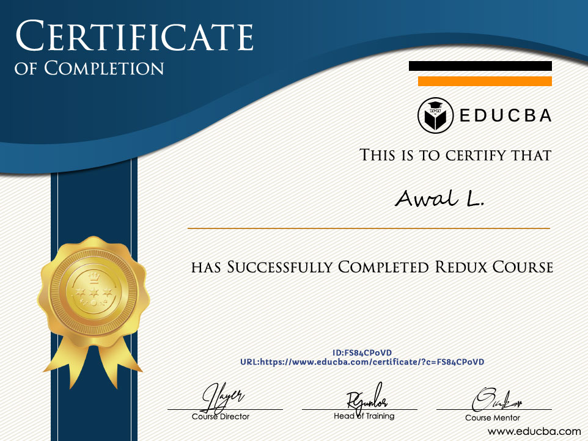
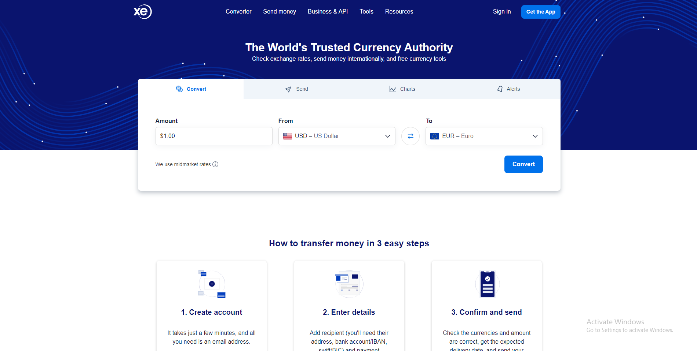

<h2>Hey </h2>👋🏻,

Skilled and Proven Software engineer.  4+ years of rich experience in front-end and backend development.   As a professional developer, providing high quality result in time is my duty. 

### 𝐒𝐤𝐢𝐥𝐥s
<table>
  <tr>
    <!-- <td></td>
         <td></td>
         <td></td>
         <td></td>
         <td></td>
         <td></td>
         <td></td> -->
    <td>
      
    </td>
    <td>
      
    </td>
    <td>
      
    </td>
    <td>
      
    </td>
    <td>
      
    </td>
    <td>
      
    </td>
    <td>
      
    </td>
  </tr>
</table>

<h1 align="center">
    <!---->
     
    
    
  </h1>
   

### Projects
<table>
  <thead align="center">
    <tr>
      <td>Filda Defi</td>
      <td>Online Tutorial</td>
      <td>CEX</td>
      <td>Token market</td>
    </tr>
  </thead>
  <tbody>
    <tr>
      <td>
        <a href="https://filda.io/">
          
          
Filda Defi

        </a>
      </td>
      <td>
        <a href="https://rhizo.us/">
          
          
Material UI + React + Typescript

        </a>
      </td>
      <td>
        <a href="https://www.cointral.com/">
          
          
CEX

        </a>
      </td>
      <td>
        <a href="https://www.xe.com/">
          
          
Token Marketing place

        </a>
      </td>
    </tr>
  </tbody>
</table>
